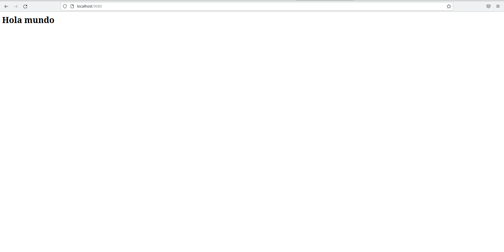

# practica2
# Tarea 2

Descarga la imagen 'httpd' y comprueba que está en tu equipo.
Crea un contenedor con el nombre 'asir_httpd'.

~~~
docker run -dit --name asir_httdp -p 8000:80 httpd:2.4
~~~

~~~
docker images
~~~
 

Mapea el puerto 80 del contenedor con el puerto 8000 de tu máquina.
 
Utiliza -v "$PWD"/htdocs:/usr/local/apache2/htdocs/
 
~~~
docker run -dit --name asir_httdp -p 8000:80 -v "$PWD"/htdocs:/usr/local/apache2/htdocs  httpd:2.4
~~~
Utiliza bind mount para que el directorio del apache2 'htdocs' este montado un directorio que tu elijas.
 
~~~
docker run -dit --name asir_httdp -p 8000:80 -v "$PWD"/htdocs:/usr/local/apache2/htdocs  httpd:2.4
~~~
Realiza un 'hola mundo' en html y comprueba que accedes desde el navegador.
 
 
Creamos un index.html en la carpeta que dirigimos antes el apache osea htdocs
 
 
Crea un contenedor 'asir_web1' que use este mismo directorio para 'htdocs' y el puerto 8000
 
~~~
docker run -dit --name asir_web1 -p 8000:80 -v "$PWD"/htdocs:/usr/local/apache2/htdocs  httpd:2.4
~~~
 
Utiliza Code para hacer un hola mundo en html
 
 
entras en el html e introduces la información que necesites haciendo un html formateado de forma correcta.
 
 
Crea otro contenedor 'asir_web2' con el mismo volumen y a otro puerto, por ejemplo 9080.
 

~~~
docker run -dit --name asir_web2 -p 9080:80 -v "$PWD"/htdocs:/usr/local/apache2/htdocs  httpd:2.4  
~~~

Comprueba que los dos servidores 'sirven' la misma página, es decir, cuando consultamos en el navegador:
 
http://localhost:9080 
http://localhost:8000
 
Tienen que salir la misma página web

